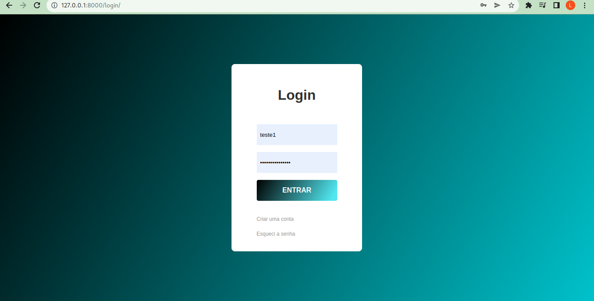
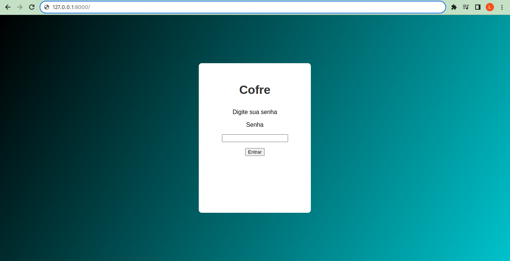
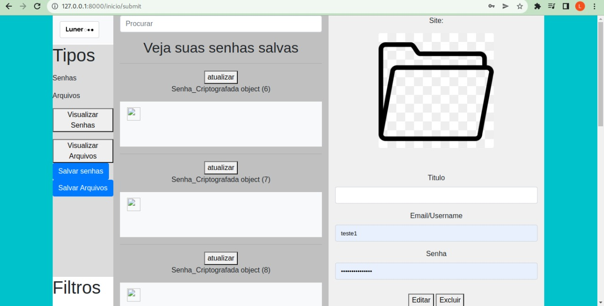

# LunerCofre
## O seu cofre de senhas e arquivos

O LunerCofre é uma aplicação desenvolvida em Python(Django)
Para armazenamento de arquivos e senhas seguras.

Utilizando a biblioteca do Fernet para criptografar seus arquivos possibilitando que só o usuário com a chave mestra, acesse o arquivo.


# Requisitos
- [x] Criar senha
- [x] Criptografar Arquivos
- [x] Visualizar Arquivos
- [ ] Melhorar tela do cofre
- [ ] Melhorar tela antes de entrar do cofre
- [ ] Corrigir bug de senha mestra
- [ ] Gerar senhas
- [ ] Aplicar Filtros


# Tela Login


# Tela Entrar No Cofre


# Tela do cofre (Ainda em modificação)



## Como usar?

### Primeiro acesso

```
sudo apt-get install libpq-dev python3-dev
sudo pip install psycopg2
pip3 install -r requirements.txt 
python3 manage.py migrate
python3 manage.py createsuperuser 
```

